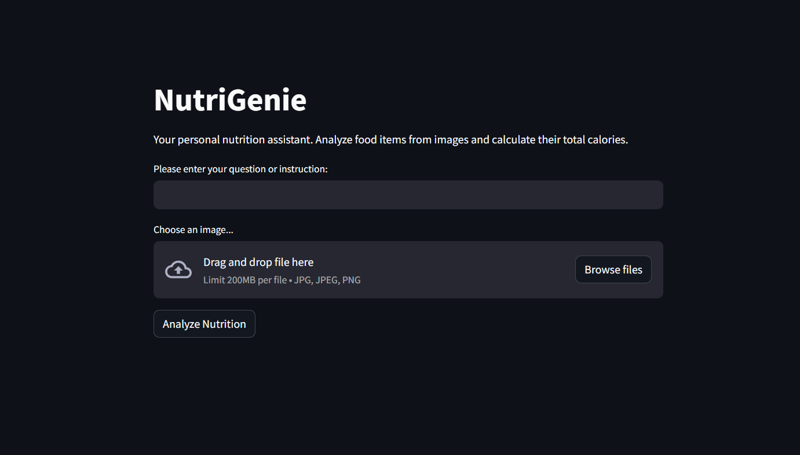

# NutriGenie

NutriGenie is a personal nutrition assistant application that allows users to analyze food items from images and calculate their total calories. This README file provides detailed instructions on setting up and running the project.

## Features

- Analyze food items from images
- Calculate total calories of food items
- Display nutritional assessment including details of food items and their calorie counts

## Screenshots




## Getting Started

To get started with NutriGenie, follow these instructions:

### Prerequisites

- Python 3.x installed on your system.
- A Google Gemini Pro Vision API key.

### Installation

1. Clone this repository to your local machine:

    ```bash
    git clone https://github.com/shihabcodes/NutriGenie.git
    ```

2. Navigate to the project directory:

    ```bash
    cd NutriGenie
    ```

3. Create a virtual environment:

    ```bash
    python -m venv venv
    ```

4. Activate the virtual environment:

    - On Windows:

        ```bash
        venv\Scripts\activate
        ```

    - On macOS and Linux:

        ```bash
        source venv/bin/activate
        ```

5. Install the required Python packages:

    ```bash
    pip install -r requirements.txt
    ```

6. Obtain a Google Gemini Pro Vision API key and set it in a `.env` file in the project directory:

    ```plaintext
    GOOGLE_API_KEY=<your_api_key>
    ```

## Running the Application

To run NutriGenie, execute the following command in your terminal within the project directory:

```bash
streamlit run app.py

```

## Usage

1. Once the application is running, you will see the NutriGenie interface in your browser.
2. Enter your question or instruction related to nutrition in the provided text input field.
3. Upload an image containing food items by clicking on the "Choose an image..." button.
4. Click on the "Analyze Nutrition" button to initiate the analysis.
5. The application will process the input and display the nutritional assessment, including details such as food items detected in the image and their respective calorie counts.

## Contributing

Contributions are welcome! Please follow these steps:

1. Fork the project.
2. Create a new branch (`git checkout -b feature/awesome-feature`).
3. Commit your changes (`git commit -m 'Add awesome feature'`).
4. Push to the branch (`git push origin feature/awesome-feature`).
5. Open a pull request.

## Notes
- Ensure that the uploaded image contains clearly visible food items for accurate analysis.
- Be descriptive while entering your question or instruction to receive relevant nutritional information.

## Additional Information
The following Python packages are used in this project:
- **Streamlit:** For building and deploying web applications.
- **Google GenerativeAI:** For integrating with Google Gemini Pro Vision API.
- **python-dotenv:** For loading environment variables from a .env file.
- **langchain:** For language processing tasks.
- **PyPDF2:** For working with PDF files.
- **chromadb:** For managing Chrome browser instances.
- **pdf2image:** For converting PDF files to images.
- **faiss-cpu:** For efficient similarity search and clustering of dense vectors.
- **langchain_google_genai:** For language processing using Google GenerativeAI.

## License
This project is licensed under the MIT License - see the [LICENSE](LICENSE) file for details.
